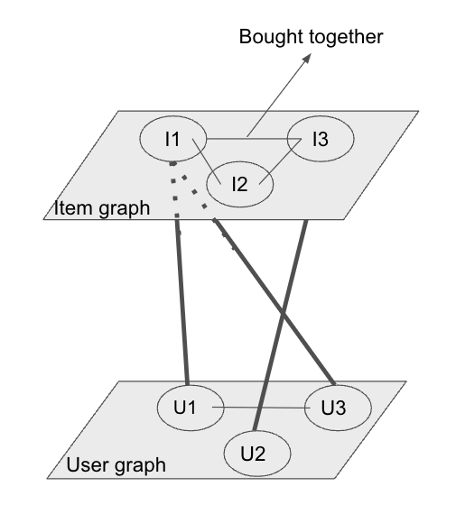

# Amazon Product Recommendation System

This project implements a graph-based recommendation system using Amazon product review data. It analyzes user-item interactions and product relationships to generate personalized recommendations through various network analysis techniques.

## Project Overview

This recommendation system aims to enhance Amazon's product recommendations using a hybrid approach combining content-based filtering and collaborative filtering. The system applies community detection, eigenvector centrality, nodal distances, and Jaccard similarities to improve link prediction. The results demonstrate that this approach performs significantly better than random recommendations.

## Project Structure

The source code is organized in the `src` directory:

- `data_processor.py`: Processes raw Amazon review data and constructs user-item graphs
- `time_window_analyzer.py`: Implements time-based analysis with rolling windows
- `community_detector.py`: Detects user communities using the Louvain method
- `network_centrality.py`: Computes network centrality metrics
- `link_predictor.py`: Predicts potential user-item interactions
- `recommend.py`: Generates personalized recommendations using hybrid approach:
  - Combines PageRank and eigenvector centrality scores
  - Implements community-based item similarity
  - Uses weighted scoring for distance-based recommendations
- `recommendation_analyzer.py`: Evaluates recommendation performance
- `data_cleaner.py`: Utility for data cleanup

Supporting scripts and configuration:
- `setup.py`: Package configuration and dependency management:
  - Defines project metadata and dependencies
  - Handles package installation and distribution
  - Configures Python package classifiers
- `run_recommendation_pipeline.sh`: Main pipeline execution script
- `cleanup.sh`: Maintenance and cleanup utility

## Features

### Hybrid Recommendation Approach:
- Combines content-based and collaborative filtering for improved accuracy

### Graph-Based Representation:
- User-item interactions are modeled as graphs for network analysis

### Community Detection:
- Utilizes the Louvain method to identify user groups with similar purchase behaviors

### Network Centrality Metrics:
- Eigenvector centrality and nodal distances are used to assess node influence

### Link Prediction Algorithms:
- Jaccard similarity is applied to predict future user-item interactions

### Time-Based Analysis:
- Incorporates rolling window validation for seasonal purchase patterns

### Performance Evaluation:
- Compares recommendation accuracy against random predictions

## Requirements

- Python 3.x
- Required Python packages:
  - networkx>=2.5
  - python-infomap>=1.0.0
  - python-louvain>=0.15
  - pandas>=1.2.0
  - numpy>=1.19.0
  - matplotlib>=3.3.0
  - scipy>=1.6.0
  - snap-stanford>=5.0.0

## Directory Structure

```
amazon-recommendation-system/
├── src/                    # Source code files
│   ├── data_processor.py
│   ├── time_window_analyzer.py
│   ├── community_detector.py
│   ├── network_centrality.py
│   ├── link_predictor.py
│   ├── recommend.py
│   ├── recommendation_analyzer.py
│   └── data_cleaner.py
├── scripts/                # Shell scripts
│   ├── run_recommendation_pipeline.sh
│   └── cleanup.sh
├── tests/                  # Test files
│   └── test_basic.py
├── docs/                   # Documentation
├── examples/               # Example notebooks and scripts
├── config/                 # Configuration files
├── data/                   # Data directory
│   ├── meta_{category}.json.gz
│   └── {category}_5.json.gz
├── image/                  # Visualization outputs
├── requirements.txt        # Project dependencies
├── setup.py               # Package setup file
├── LICENSE                # MIT License
└── README.md             # Project documentation
```

## Data Structure

The system expects Amazon review data in the following format:
- Product metadata: `meta_{category}.json.gz`
- Review data: `{category}_5.json.gz`
- Data location: `data/{category}/`

The dataset contains Amazon product reviews from 2011 to 2013, used to predict purchases in 2014. The filtering criteria include:
- Users who reviewed at least 5 products
- Reviews with ratings of 4 or higher

## Installation

```bash
# Clone the repository
git clone https://github.com/yourusername/amazon-recommendation-system.git
cd amazon-recommendation-system

# Create and activate a virtual environment (optional but recommended)
python -m venv venv
source venv/bin/activate  # On Windows, use `venv\Scripts\activate`

# Install dependencies
pip install -r requirements.txt

# Install the package in development mode
pip install -e .
```

## Usage

The project provides two main scripts in the `scripts` directory:

### Running the Recommendation Pipeline

```bash
# Navigate to the scripts directory
cd scripts

# Run with default settings
./run_recommendation_pipeline.sh

# Run with custom parameters
./run_recommendation_pipeline.sh -c electronics -r 4 -n 20

# Get help
./run_recommendation_pipeline.sh --help
```

Options:
- `-c, --category`: Product category (default: musical_instruments)
- `-r, --rating`: Minimum rating threshold (default: 4)
- `-n, --recommendations`: Number of recommendations per user (default: 10)
- `-y, --year`: Year for analysis (default: 2014)
- `-m, --months`: Months for analysis (default: 101112)

### Cleaning Up

```bash
# Clean up a specific category
./cleanup.sh -c electronics

# Clean all categories
./cleanup.sh --all

# Clean but keep final results and visualizations
./cleanup.sh -c electronics --keep-results

# Get help
./cleanup.sh --help
```

Options:
- `-c, --category`: Product category to clean
- `-a, --all`: Clean all categories
- `-k, --keep-results`: Keep final results and visualizations
- `-h, --help`: Display help message

## Performance Evaluation

The system measures recommendation performance using:
- Prediction accuracy
- Community-based evaluation
- Time-based validation
- Visualization of clusters and recommendation outcomes

### Results Summary:
- Musical Instruments: 0.426% accuracy (1000x better than random selection)
- Pet Supplies: 0.310% accuracy
- Random recommendation accuracy: 0%

### Effect of Rating Threshold:
- Rating ≥ 4: 0.310% accuracy
- All ratings: 0.017% accuracy

### Effect of Rolling Window Analysis:
- Whole 2014 year: 0.426% accuracy
- Seasonal breakdowns: Lower accuracy due to purchase seasonality

## Visualizations

The following figures represent different aspects of our recommendation system:

### User Graph Visualizations
.png)
*Figure 1: User graph visualization using Fruchterman layout, showing user relationships and community structures.*

.png)
*Figure 2: Alternative visualization of user graph using Yifan Hu layout, highlighting different community patterns.*

### Combined User-Item Graph

*Figure 3: Combined user-item graph structure showing the relationships between users and products.*

### Community Detection Results

*Figure 4: Results of community detection using the Louvain method, demonstrating the identified user clusters.*

These visualizations help demonstrate:
- The structure of user relationships and communities
- The interconnections between users and items
- The effectiveness of our community detection approach
- The overall network structure of our recommendation system

## Future Work

- Incorporating weighted centrality measures
- Exploring machine learning optimization for link prediction
- Expanding recommendation criteria beyond network structure
- Integrating additional metadata features for improved accuracy

## Testing

To run the tests:

```bash
python -m unittest discover tests
```

## Contributing

1. Fork the repository
2. Create your feature branch (`git checkout -b feature/AmazingFeature`)
3. Commit your changes (`git commit -m 'Add some AmazingFeature'`)
4. Push to the branch (`git push origin feature/AmazingFeature`)
5. Open a Pull Request

## License

This project is licensed under the MIT License - see the [LICENSE](LICENSE) file for details.

## Contributors

- Yan-Da Chen
- Ling-Yuan Chen 